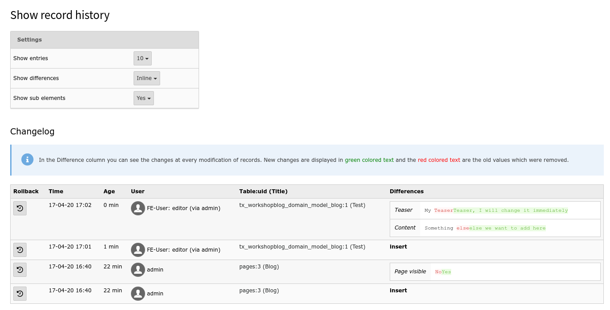

.. ==================================================
.. FOR YOUR INFORMATION
.. --------------------------------------------------
.. -*- coding: utf-8 -*- with BOM.

.. include:: ../Includes.txt

.. _introduction:

Introduction
------------

.. _what-does-it-do:

What does it do?
^^^^^^^^^^^^^^^^

This extension provides the possibility of tracking frontend related changes for every data type, extbase can manipulate.
In big projects with many frontend related changes you are able to refactor, overview and undo
changes made in frontend. You will even see, which user made the change.

.. _screenshots:

Screenshots
^^^^^^^^^^^

   The view of the history module inside the TYPO3 backend.
